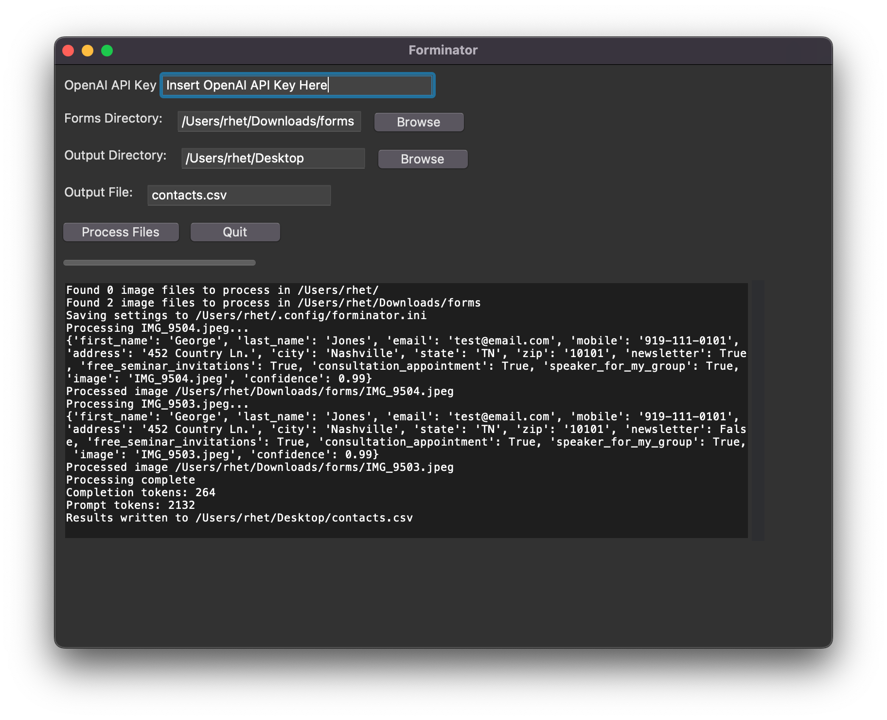

# Forminator

Use OpenAI's GPT-4o to process images of customer contact forms and create a CSV file of the form data.

This is a personal project for a very specific use case but the prompt could be modified to work with other forms.

The project includes a GUI for selecting the image files and running the model.

## Installation

```bash
pip install -r requirements.txt
```

## Usage

```bash
python forminator.py
```

You will need to provide an API key for OpenAI's GPT-4o. You can get one [here](https://platform.openai.com/signup).



## License

GNU General Public License v3.0
